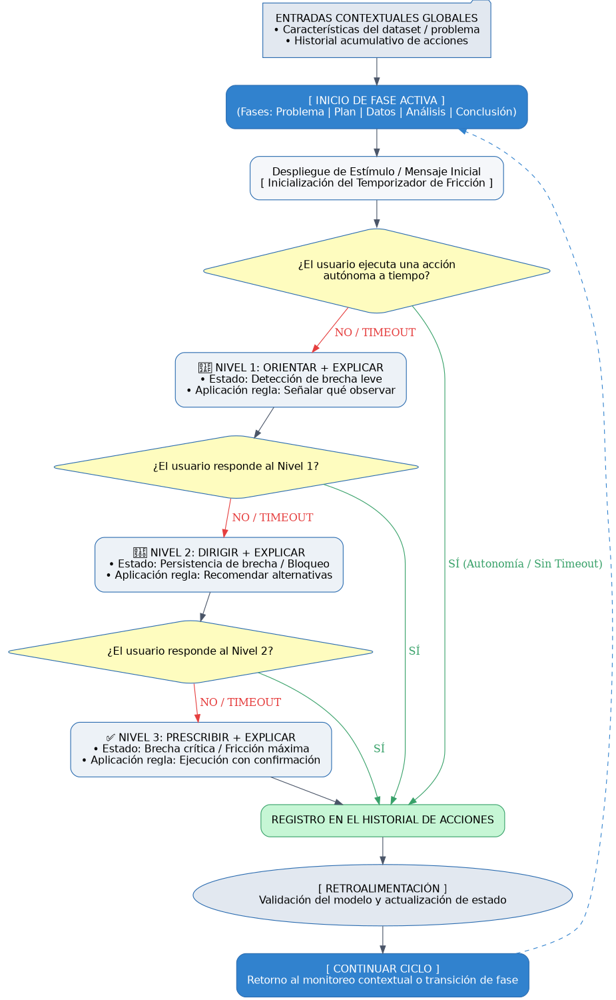

# 🧠 Arquitectura del Motor de Guidance Contextual

El **Motor de Guidance** opera de manera transversal a lo largo de las cinco fases del ciclo analítico (*Problema, Plan, Datos, Análisis y Conclusión*). Su propósito fundamental es monitorear la autonomía del usuario, detectar de manera oportuna brechas cognitivas o metodológicas, y dosificar el nivel de apoyo pedagógico de forma progresiva.

---

## ⚙️ 1. Lógica y Reglas Operativas del Motor

El motor opera como un sistema de toma de decisiones adaptativo que regula la interacción entre el usuario y las fases analíticas mediante las siguientes reglas internas:

### A. El Ciclo de Inicialización y el Contexto Global
*   **Ingreso al Estado Activo (`[ INICIO DE FASE ACTIVA ]`)**: El sistema identifica la etapa analítica actual del usuario y carga las directrices correspondientes.
*   **Inyección de Entradas Contextuales**: El núcleo de decisión recopila en tiempo real dos variables de estado clave:
    1. *Las características del dataset o problema actual* (para calibrar la complejidad técnica).
    2. *El historial acumulativo de acciones* (la memoria de interacciones previas, aciertos y niveles de ayuda consumidos).
*   **Temporizador de Fricción**: Se despliega el estímulo inicial de la fase y se arranca un cronómetro interno para medir el tiempo que tarda el usuario en dar una respuesta autónoma.

### B. La Regla de Decisión 0: La Ruta del Éxito (Sin Timeout)
Una vez iniciado el temporizador, el motor evalúa si el usuario ejecuta una acción autónoma a tiempo:
*   **Condición (SÍ)**: Si el usuario responde o resuelve el requerimiento de forma independiente *antes* de que expire el tiempo límite.
*   **Comportamiento del Sistema**: 
    *   **Omisión de Escalada**: El motor valida que el usuario cuenta con el dominio necesario, bloqueando y omitiendo por completo los niveles de ayuda (Niveles 1, 2 y 3).
    *   **Registro Directo**: La acción autónoma se captura y se envía de inmediato al registro histórico.
    *   **Continuidad**: Se da por superada la fase y se emite la señal para avanzar a la siguiente etapa del análisis.

### C. La Regla de Escalada Gradual (Ante Demoras o Timeout)
Si el temporizador expira sin aportes del usuario (**Respuesta NO / Timeout**), el sistema interpreta una brecha cognitiva o bloqueo, activando un andamiaje progresivo:
*   🎯 **Nivel 1 (Orientar + Explicar / Brecha Leve)**: Aplica la regla de *señalar qué observar*. El sistema filtra el contexto y muestra pistas sobre qué variables o métricas atender sin dar la respuesta directa.
*   🔀 **Nivel 2 (Dirigir + Explicar / Bloqueo Persistente)**: Aplica la regla de *recomendar alternativas*. Si el Nivel 1 falla, el sistema ofrece rutas metodológicas alternas justificando el impacto de cada opción.
*   ✅ **Nivel 3 (Prescribir + Explicar / Fricción Crítica)**: Aplica la regla de *acción con confirmación*. Ante un bloqueo total, el sistema formula o ejecuta una solución técnica directa solicitando confirmación explícita y explicando su fundamento.

### D. Convergencia y Cierre del Ciclo
Independientemente de la ruta tomada (la autónoma directa o cualquiera de los niveles de ayuda), **todas las interacciones convergen obligatoriamente en un único punto**: el registro en el historial. Esto actualiza la memoria de la sesión, valida el modelo mediante retroalimentación y da la orden de continuar el ciclo.

---

## 📊 2. Diagrama de Flujo del Motor (Graphviz)

Puedes renderizar este flujo copiando el siguiente código en plataformas compatibles como [GraphvizOnline](https://dreampuf.github.io/GraphvizOnline/):



---

## 🚀 3. Implementación actual: Fase 1 — Comprensión del dataset

La primera fase implementa un tutor pedagógico para ayudar al estudiante a formular una pregunta de análisis que sea viable con las variables reales del CSV. No responde todavía la pregunta analítica: su resultado es una **consulta validada o prescrita** que servirá como entrada para las fases posteriores de análisis y visualización.

### Objetivo

1. Cargar y clasificar las variables del dataset.
2. Recibir una duda del estudiante.
3. Verificar con un LLM si puede responderse con esas variables.
4. Escalar la ayuda de forma gradual si la pregunta no es viable o si vence el tiempo.
5. Registrar preguntas, decisiones y retroalimentación de la sesión.

### Arquitectura

```text
Navegador (front: HTML + CSS + JavaScript + D3 preparado)
                    │
                    ▼
           Flask: app.py (API local)
             │                    │
             ▼                    ▼
  Pandas + archivo CSV       agente.py + prompts.py
                                  │
                                  ▼
                         Groq / modelo LLM
```

El navegador nunca recibe la clave de Groq. Las llamadas al LLM se realizan exclusivamente desde Flask/Python.

### Archivos involucrados

| Archivo o carpeta | Responsabilidad |
| --- | --- |
| `app.py` | API Flask, lectura del CSV, taxonomía de variables, publicación del frontend y rutas que invocan el agente. |
| `agente.py` | Clase `MotorAnalisis`: consulta la API local y se comunica con Groq. |
| `prompts.py` | Prompts pedagógicos para validar preguntas, describir variables, sugerir y prescribir consultas. |
| `main.py` | Versión de consola del mismo flujo de Fase 1. |
| `front/index.html` | Estructura de la interfaz web. |
| `front/styles.css` | Diseño responsive de la interfaz. |
| `front/app.js` | Máquina de estados del frontend, temporizador, historial y llamadas `fetch` a Flask. |
| `estado_fase1.json` | Registro generado por la versión de consola; almacena variables, preguntas, eventos y estado temporal. |

---

## 🧭 4. Flujo pedagógico de la Fase 1

El límite actual es de **30 segundos** por interacción. En la versión web se configura en `front/app.js` con `LIMIT = 30`; en la versión de consola se configura en `main.py` con `TIEMPO_LIMITE_SEGUNDOS = 30`.

### Nivel 1 — Preguntar y validar

El sistema muestra el mensaje:

```text
Escribe tu pregunta o duda para analizar el CSV
```

El LLM recibe la pregunta y la taxonomía de variables. Después explica una de estas situaciones:

- `✅ Muy buena pregunta`: se puede responder con las columnas disponibles.
- `⚠️ La pregunta necesita precisión`: hay ambigüedad y se indica qué debe aclararse.
- `❌ Esta pregunta no se puede responder`: faltan variables o información necesaria.

Si vence el temporizador o la pregunta no es viable, el flujo pasa al Nivel 2.

### Nivel 2 — Orientar con variables y validar de nuevo

El sistema muestra todas las variables clasificadas como temporales, numéricas y categóricas. Después solicita al LLM una descripción breve de cada una: qué representa, qué puede medir o, cuando no se puede saber con certeza, una inferencia explícita.

El estudiante responde nuevamente a:

```text
¿Qué consulta desearías saber con estas variables?
```

La nueva pregunta se valida y explica con las mismas reglas del Nivel 1. Si vuelve a fallar o expira el tiempo, se activa el Nivel 3.

### Nivel 3 — Sugerir tres preguntas viables

El LLM genera exactamente tres preguntas que pueden responderse con el dataset. Para cada una informa:

- La pregunta propuesta.
- Las variables que conecta.
- El motivo o utilidad de analizarla.

El estudiante elige una opción (`1`, `2` o `3`) dentro de 30 segundos. Si elige una, la pregunta queda definida como la consulta con la que continuará el análisis.

### Nivel 4 — Prescribir una pregunta

Este nivel se activa **solo si el estudiante no elige una opción válida en el Nivel 3**. El LLM compara las tres opciones y toma la decisión pedagógica. Devuelve:

```text
ELECCION: 1
JUSTIFICACION: <por qué se prescribe y cómo ayudará al análisis>
```

Así, el sistema no selecciona una pregunta al azar: el LLM prescribe la alternativa más clara y viable según las variables disponibles.

---

## 🌐 5. Interfaz web

La interfaz se sirve desde Flask y se abre en:

```text
http://127.0.0.1:5000
```

Incluye indicador del nivel activo, temporizador, mensajes de retroalimentación, tarjetas de variables, tarjetas para las tres preguntas sugeridas e historial de la sesión en `localStorage`.

La etiqueta de D3.js ya está incluida en `front/index.html`:

```html
<script src="https://cdn.jsdelivr.net/npm/d3@7"></script>
```

Por ello, las visualizaciones futuras pueden crearse en `front/app.js` usando el objeto global `d3`, sin cambiar la arquitectura del frontend.

El frontend apunta a Flask incluso si se abre con Live Server o una vista previa del IDE. Flask incluye cabeceras CORS para estas pruebas locales.

---

## 🔌 6. Endpoints de la API

| Método | Ruta | Uso |
| --- | --- | --- |
| `GET` | `/` | Sirve la interfaz web. |
| `GET` | `/api/tarjeta-identidad` | Filas, columnas, peso y cobertura temporal del CSV. |
| `GET` | `/api/diagnostico-calidad` | Nulos, outliers y estructura temporal. |
| `GET` | `/api/taxonomia-variables` | Variables agrupadas en temporales, numéricas y categóricas. |
| `POST` | `/api/validar-pregunta` | Valida una pregunta. Cuerpo: `{ "pregunta": "..." }`. |
| `GET` | `/api/describir-variables` | Devuelve la explicación breve de cada variable. |
| `GET` | `/api/preguntas-sugeridas` | Genera tres preguntas viables con sus motivos. |
| `POST` | `/api/prescribir-pregunta` | El LLM escoge una de tres preguntas. Cuerpo: `{ "preguntas": ["...", "...", "..."] }`. |

---

## ▶️ 7. Instalación y ejecución

### Requisitos

- Python 3.11 o compatible.
- Entorno Conda `vis`.
- Paquetes: `flask`, `pandas`, `numpy`, `requests`, `openai` y `python-dotenv`.
- Archivo CSV en la ruta definida por `CSV_PATH` dentro de `app.py`.
- Una clave válida de Groq en `.env`.

Ejemplo de `.env`:

```env
OPENAI_API_KEY=tu_clave_de_groq
```

Instalación de dependencias:

```bash
conda activate vis
python3 -m pip install openai python-dotenv requests flask pandas numpy
```

Inicio del servidor y frontend:

```bash
conda activate vis
python3 app.py
```

Luego abre `http://127.0.0.1:5000` en el navegador.

Para probar únicamente la versión de terminal:

```bash
conda activate vis
python3 main.py
```

### Si el navegador muestra un error de conexión

1. Confirma que Flask siga ejecutándose en la terminal.
2. Reinicia Flask después de modificar `app.py`.
3. Recarga el navegador sin caché con `⌘ + Shift + R`.
4. Comprueba que el frontend use `http://127.0.0.1:5000` o que Flask esté activo si lo abres desde una vista previa del IDE.

---

## ✅ 8. Casos de prueba recomendados

| Caso | Acción esperada |
| --- | --- |
| Pregunta viable | El LLM la valida en el Nivel 1 y termina la Fase 1. |
| Pregunta no relacionada | El sistema explica la limitación y avanza al Nivel 2. |
| Timeout en el Nivel 1 | Muestra variables y explicaciones en el Nivel 2. |
| Segunda pregunta viable | El LLM la valida en el Nivel 2 y termina la Fase 1. |
| Timeout o pregunta no viable en el Nivel 2 | Presenta tres preguntas en el Nivel 3. |
| Selección del usuario en el Nivel 3 | Guarda la pregunta elegida como consulta final. |
| Timeout en el Nivel 3 | El LLM prescribe la mejor opción en el Nivel 4 con justificación. |

---

## 🔐 9. Consideraciones de seguridad y alcance

- No subas el archivo `.env` ni la clave de Groq al repositorio.
- La aplicación actual está pensada para pruebas locales; antes de desplegarla se deben restringir CORS, proteger los endpoints y validar límites de uso del LLM.
- La Fase 1 clasifica, orienta y valida preguntas; todavía no calcula resultados estadísticos ni dibuja gráficos. Esas tareas corresponden a las fases siguientes.